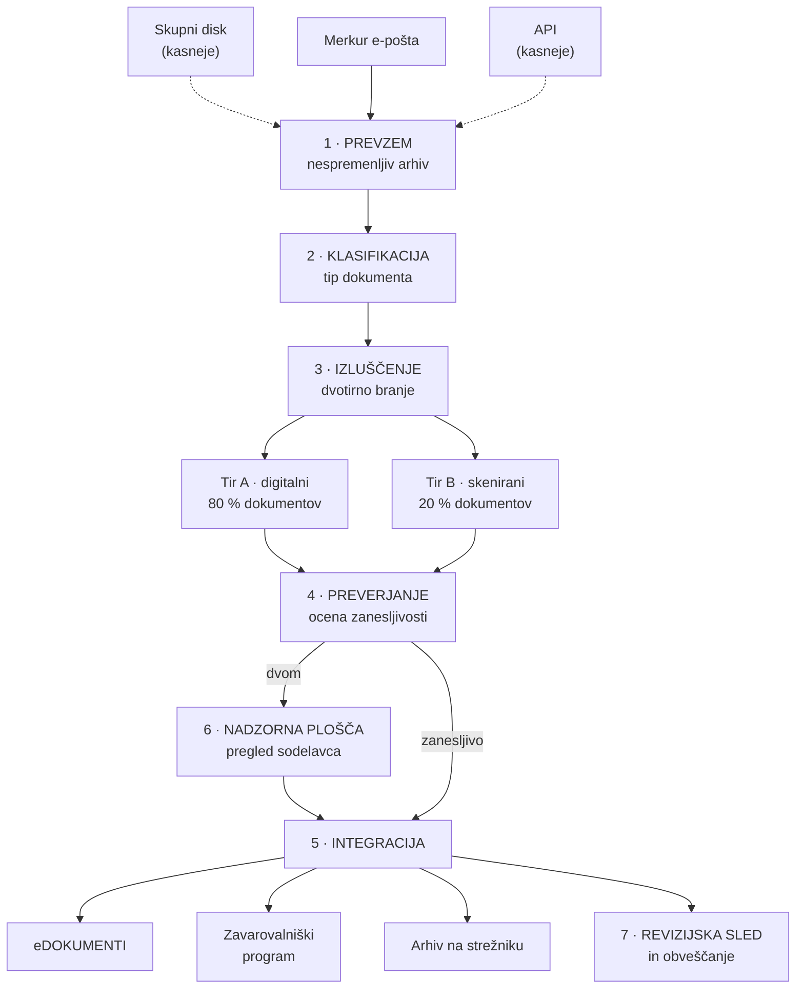

# PRENOS ZERO

## Robotizacija procesa PRENOS dokumentacije

**Naročnik:** Harvest Hub, zavarovalniško zastopanje d.o.o., Dunajska cesta 190, 1000 Ljubljana
**Ponudnik:** AIS
**Datum:** 26. 7. 2026
**Veljavnost ponudbe:** 30 dni (do 25. 8. 2026)
**Referenca:** Specifikacija zahtev za pripravo rešitve — Robotizacija procesa PRENOS, 23. 7. 2026

---

# Kazalo

1. **Povzetek**
2. **Kaj smo ugotovili iz vaše dokumentacije**
   2.1 Delež digitalnih in skeniranih dokumentov · 2.2 Zamenjava oznak in vrednosti ·
   2.3 Številka ponudbe kot podatek o produktu · 2.4 Neenotna poimenovanja polj ·
   2.5 Varstvo osebnih podatkov
3. **Predlagana rešitev**
   3.1 Arhitektura · 3.2 Opis slojev · 3.3 Obravnava posebnosti iz specifikacije
4. **Odgovor na vaše vprašanje o zaznamku**
5. **AI tehnologija**
6. **Rešitev 1 in Rešitev 2**
7. **Cena**
8. **Kaj ni vključeno**
9. **Časovnica**
10. **Jamstva**
11. **Predpostavke in tveganja**
12. **Naslednji koraki**

---

# 1. Povzetek

Danes vaš sodelavec za vsako ponudbo Merkurja ročno prevzame dokumentacijo iz e-pošte, jo shrani v
mapo na strežniku in **iste podatke dvakrat na roko prepiše** — enkrat v eDOKUMENTE, drugič v
Zavarovalniški program. Pri 300–500 ponudbah mesečno in približno sedmih dokumentih na ponudbo gre za
več tisoč ročnih posegov letno, od katerih vsak lahko vsebuje napako.

**PRENOS ZERO** je robot, ki ta proces prevzame v celoti:

> **Ponudba prispe. Vse ostalo se zgodi samo.**

Rešitev prevzame dokumentacijo iz e-pošte, samodejno prebere metapodatke iz PDF-jev, izvede predpisane
kontrole, prenese dokumente in podatke v oba sistema ter vsak korak zabeleži v revizijsko sled. Kar ni
zanesljivo prebrano, se **nikoli ne zapiše samodejno** — uvrsti se v pregled sodelavca.

Ta ponudba odgovarja na vseh pet točk vaše specifikacije: ponudbeno ceno, časovnico, tehnično rešitev,
uporabljeno AI tehnologijo in ostalo glede predlagane rešitve — za **obe** predlagani različici.

---

# 2. Kaj smo ugotovili iz vaše dokumentacije

Preden smo pripravili ponudbo, smo tehnično analizirali **vseh 15 vzorčnih PDF dokumentov**, ki ste
jih priložili. Ugotovitve neposredno določajo arhitekturo rešitve in so razlog, da se naš pristop
razlikuje od standardnega odgovora „uporabimo OCR".

## 2.1 Približno 80 % dokumentov je digitalno generiranih, 20 % je skeniranih

| Dokument | Strani | Besedilni sloj | Ugotovitev |
|---|---|---|---|
| 545. člen | 1 | 5.376 znakov | digitalni |
| KLP (en zastopnik) | 1 | 615 | digitalni |
| KLP (dva zastopnika) | 1 | 685 | digitalni |
| Privolitvena izjava | 1 | 2.806 | digitalni |
| 1 – Naložbeno | 3 | 12.034 | digitalni |
| 2 – Nezgoda | 2 | 3.437 | digitalni |
| 2 – Otroci (1 otrok) | 2 | 3.358 | digitalni |
| **2 – Merkur, dva otroka** | 1 | **78** | **skeniran** |
| **3 – Otroci, več produktov** | 1 | **164** | **skeniran** |
| 4 – Premoženje | 4 | 7.203 | digitalni |
| 5 – Riziko | 3 | 3.210 | digitalni |
| 6 – Zdravstveno | 2 | 3.278 | digitalni |
| 7 – Popotnik | 1 | 2.324 | digitalni |
| 8 – Business box | 3 | 4.195 | digitalni |
| **9 – Kolektivno Zdravje** | 2 | **23** | **skeniran + rokopis** |

Dokument št. 9 (Kolektivno Zdravje za pravne osebe) je natisnjen, **ročno pripisan in ponovno
skeniran** — vsebuje rokopisne opombe in oznake z markerjem.

**Posledica za rešitev:** ena sama tehnologija za branje vseh dokumentov je napačna odločitev. Za
80 % dokumentov je OCR nepotreben, počasen in manj natančen od neposrednega branja besedilnega sloja.
Za preostalih 20 % je nujen napreden vizualni model. Zato gradimo **dvotirni sistem branja**, ki za
vsak dokument sam izbere pravo pot.

## 2.2 Preprosto branje besedila zamenja oznake in vrednosti

Pri neposrednem izvozu besedila iz dokumenta *2 – Nezgoda* se vrednosti in njihove oznake vrnejo
**ločeno**: najprej vsi zneski, šele nato vsa poimenovanja polj. Preprost program, ki išče vzorce,
jih poveže napačno — in kar je najbolj nevarno, **rezultat je videti pravilen.**

Pri zavarovalniških podatkih je tiha napaka dražja od očitne. Zato uporabljamo branje, ki upošteva
**postavitev dokumenta in koordinate polj**, ne zgolj zaporedja besedila.

## 2.3 Številka ponudbe nosi podatek o vrsti zavarovanja

| Predpona | Produkt | Primer iz vaših vzorcev |
|---|---|---|
| `11x` | Zdravstveno zavarovanje | 110004554 |
| `22x` | Riziko | 220004272 |
| `33x` | Nezgoda | 330009276 |
| `44x` | Business box (pravne osebe) | 440000040 |
| `55x` | Naložbeno zavarovanje | 550002145 |

Vzorec smo potrdili tudi na seznamu map z vašega strežnika, priloženem specifikaciji. To pomeni, da
robot **brezplačno pridobi razvrstitev produkta in dodatno kontrolo**: če vsebina dokumenta kaže na
nezgodno zavarovanje, številka pa se začne s `55`, sistem to označi kot neskladje — namesto da bi
napako tiho prenesel naprej.

## 2.4 Poimenovanja polj med produkti niso enotna

V dokumentih se pojavljata tako `Številka ponudbe` kot `Št. ponudbe`; Premoženje in Popotnik
uporabljata dodatne različice; KLP z dvema zastopnikoma nosi 11-mestno številko, ostali 9-mestno.
**Enotna predloga za vse produkte ne more delovati.** Rešitev zato temelji na skupnem jedru podatkov
in nadgradnjah po posameznem produktu.

## 2.5 Varstvo osebnih podatkov je del arhitekture, ne dodatek

Dokumentacija vsebuje davčne številke, rojstne datume, naslove, kontaktne podatke in upravičence, pri
zdravstvenih in nezgodnih produktih pa tudi **podatke, povezane z zdravjem — posebno vrsto osebnih
podatkov po 9. členu GDPR.** Privolitvena izjava je sama po sebi dokazilo o privolitvi. Rešitev zato
že v zasnovi predvideva obdelavo izključno znotraj EU, šifriranje, politiko hrambe in popolno
revizijsko sled.

---

# 3. Predlagana rešitev

## 3.1 Arhitektura

## 3.2 Opis slojev

**1 · Prevzem.** Robot prevzame vhodno dokumentacijo z naslova `ponudbe.merkur@harvest.si`. Vsaka
pošiljka se najprej zapiše v **nespremenljiv arhiv**, šele nato v obdelavo — kar pomeni, da je vsako
ponudbo mogoče kadar koli ponovno obdelati, ne da bi Merkur prosili za ponovno pošiljanje. Podvojena
e-pošta nikoli ne ustvari dveh ponudb.

Vaša specifikacija predvideva **kasnejšo** priključitev skupnega diska in API-ja. Sloj prevzema zato
gradimo kot izmenljive priključke na enoten vmesnik: dodajanje novega vira je nastavitev, ne
predelava sistema.

**2 · Klasifikacija.** Sistem prepozna tip vsakega dokumenta: Ponudba, 545. člen, IDD, KID, SEPA,
SID, Splošni pogoji, Informacije o obdelavi osebnih podatkov, Informativni izračun, Spremni dopis.
Uporabi najcenejši zadostni signal — ime datoteke, predpono številke ponudbe, prstni odtis besedila —
in AI vključi le ob dejanski dvoumnosti.

**3 · Izluščenje.** Jedro rešitve, dvotirno:

- **Tir A (digitalni dokumenti, ~80 %):** branje z upoštevanjem postavitve in koordinat, nato
  strukturiranje v predpisano podatkovno shemo. Hitro, natančno, poceni.
- **Tir B (skenirani dokumenti, ~20 %):** izris strani in obdelava z vizualnim modelom Claude v isto
  shemo. Pokriva tudi primer št. 9 z rokopisnimi pripisi.

Podatkovna shema ima skupno jedro (zavarovalec, zavarovanec, številka ponudbe, zastopnik in številka
licence, začetek zavarovanja, premija, frekvenca in način plačila, upravičenci) ter razširitve po
produktih.

**4 · Preverjanje.** Vsako polje dobi oceno zanesljivosti. Poleg tega tečejo kontrole, ki AI sploh ne
potrebujejo:

- predpona številke ponudbe se mora ujemati z zaznanim produktom,
- **kontrolna številka davčne številke (mod 11)** — napačna davčna številka je ujeta računsko,
- letna premija se mora ujemati z obrokom in frekvenco plačila,
- ime in naslov se morata ujemati med Ponudbo, SEPA in IDD,
- datumi morajo biti logični.

Kar ne doseže praga zanesljivosti, **se ne zapiše v vaše sisteme.**

**5 · Integracija.** Prenos dokumentov in metapodatkov v eDOKUMENTE, metapodatkov v Zavarovalniški
program ter arhiviranje na strežnik po vaši obstoječi konvenciji `Datum-Priimek in ime-Številka ponudbe`.

**6 · Nadzorna plošča.** Ni poročilo, ampak delovna vrsta. Prikaže le izjeme: nezanesljiva polja,
manjkajoče dokumente, neznane produkte, neuspele prenose. Sodelavec vidi PDF in prebrane vrednosti
drug ob drugem in popravi z enim klikom. **Vsak popravek se shrani kot učni podatek**, zato se
natančnost sčasoma izboljšuje.

**7 · Revizijska sled in obveščanje.** Nespremenljiv zapis vsakega koraka: kdo (robot ali poimenovan
sodelavec), kdaj, kaj pred in po. Isti zapis služi kot dokazilo o skladnosti po GDPR in ZZavar-1.
Obveščanje o neuspelih prenosih po stopnji resnosti — kot zahteva vaša specifikacija — ter tedensko
poročilo o obdelanih ponudbah, deležu popolne avtomatizacije in vrstah napak.

## 3.3 Obravnava obeh posebnosti iz specifikacije

**Manjkajoči 545. člen.** Robot ob prevzemu preveri prisotnost dokumenta. Če ga ni, preko API-ja v
eDOKUMENTE vrne opozorilo, ponudbo pa zadrži — nikoli je tiho ne izpusti.

**Kolektivna zdravstvena in nezgodna zavarovanja za pravne osebe.** Ker postopek sklepanja v celoti
izvede skrbnik na Merkurju, dokumentacija upravičeno prispe **brez** 545. člena. Sistem ta primer
prepozna po predponi številke ponudbe in vrsti produkta ter ga usmeri na pot **pričakovane izjeme**,
ne napake: v eDOKUMENTE vpiše zaznamek, samodejno opominja do prejema podpisanega dokumenta in ob
prejemu zaznamek sam zapre.

---

# 4. Odgovor na vaše vprašanje o zaznamku

> *„Do prejema dokumenta mora Robot v sistemu eDOKUMENTI evidentirati zaznamek, da dokument 545. člen
> še ni bil prejet in ga je potrebno naknadno pridobiti (svetujte kako naj ga robot doda v Edokumente)."*

Predlagamo tri možnosti, razvrščene po priporočilu. Katera je izvedljiva, potrdimo v Fazi 0, ko
vidimo dokumentacijo API-ja.

| | Mehanizem | Ocena |
|---|---|---|
| **1** | **Strukturirano statusno polje** na zapisu ponudbe (`545_CLEN: V ČAKANJU / PREJETO`) skupaj z datiranim zaznamkom | **Priporočeno.** Je strojno berljivo, zato lahko robot samodejno opominja, ob prejemu status sam zapre in o tem poroča. Prostotekstovnega zapisa ni mogoče poizvedovati. |
| **2** | **Nadomestni zapis dokumenta** tipa *545. člen* s statusom „v pričakovanju" | Dobra alternativa, če eDOKUMENTI ne podpirajo lastnih statusnih polj. Ponudba ostane vidno nepopolna v vašem obstoječem vmesniku. |
| **3** | **Prostotekstovni zaznamek** | Le če API ne omogoča ničesar drugega. Človeku viden, a robot nikoli ne more potrditi razrešitve. |

V vseh treh primerih robot vodi celoten življenjski cikel: opozori → opominja po urniku → ob prejemu
podpisanega dokumenta samodejno zapre → sprosti ponudbo v nadaljnjo obdelavo.

---

# 5. AI tehnologija

Vaša specifikacija izrecno sprašuje po predvideni AI tehnologiji za obdelavo in branje PDF
dokumentacije.

**Uporabljamo Claude družbe Anthropic.** Konkretno:

| Naloga | Pristop |
|---|---|
| Klasifikacija dokumentov | Pravila in prstni odtisi besedila; AI le ob dvoumnosti |
| Branje digitalnih PDF (~80 %) | Branje s koordinatami + strukturiranje s Claude v predpisano shemo |
| Branje skeniranih PDF (~20 %) | Vizualni model Claude nad izrisom strani |
| Preverjanje | Deterministične kontrole (kontrolne številke, računska skladnost) — brez AI |

**Zakaj ta pristop in ne klasični OCR.** Klasični OCR pretvori sliko v besedilo, ne razume pa
strukture dokumenta. Ker se poimenovanja polj med produkti razlikujejo (točka 2.4) in ker se pri
neposrednem branju vrednosti in oznake ločijo (točka 2.2), OCR v kombinaciji z vzorci daje rezultate,
ki so pogosto napačni, videti pa pravilni. Jezikovni model razume dokument kot celoto — prepozna, da
je „305,50 €" letna premija in ne zavarovalna vsota, tudi kadar sta v dokumentu daleč narazen.

**Varstvo podatkov.** Obdelava poteka izključno znotraj EU. Podatki se **ne uporabljajo za učenje
modelov**. Prenos in hramba sta šifrirana. Celotna revizijska sled ostane pri vas.

**Strošek delovanja AI.** Izračunan po ceniku najzmogljivejšega modela (Claude Opus 4.8) pri
500 ponudbah mesečno:

| Postavka | Mesečno |
|---|---|
| Klasifikacija | ~3 € |
| Branje — digitalni tir | ~20 € |
| Branje — vizualni tir | ~8 € |
| Preverjanje in kontrole | ~9 € |
| **AI skupaj** | **~40–50 €** |
| Gostovanje (strežnik, baza, hramba; EU) | 30–60 € |
| **Skupni strošek delovanja** | **~80–110 € / mesec** |

Za primerjavo: mesečni strošek umetne inteligence je nižji od stroška ene ure dela, ki ga nadomešča.

---

# 6. Rešitev 1 in Rešitev 2

Vaša specifikacija zahteva oceno za obe različici.

| | **REŠITEV 1** | **REŠITEV 2** |
|---|---|---|
| Prevzem, klasifikacija, branje, preverjanje | ✔ | ✔ |
| Prenos v eDOKUMENTE | ✔ | ✔ |
| Kdo pripravi KLP in Privolitveno izjavo | eDOKUMENTI (nespremenjeno) | **Robot** |
| Postopek podpisa Privolitvene izjave | eDOKUMENTI | **Robot** (slikovni podpis, skladno s specifikacijo — ne gre za kvalificiran e-podpis) |
| Potrebna povratna informacija iz eDOKUMENTOV | **Da — nujna odvisnost** | Ne |
| Prenos v Zavarovalniški program | po prejemu potrditve | neposredno |
| Odvisnost od ponudnika eDOKUMENTOV | **visoka** | nizka |

## Priporočamo Rešitev 2

Ne zaradi večjega obsega, ampak zaradi tveganja. **Kritična pot Rešitve 1 poteka skozi sistem, ki ni
naš in ni vaš.** Če eDOKUMENTI ne zmorejo poslati povratne informacije o zaključenem postopku, se
proces ustavi — pri ponudniku, na katerega nima vpliva nobeden od naju.

Rešitev 2 vam da sistem, ki ga obvladujete od začetka do konca, in odpravi strateško odvisnost od
zunanjega ponudnika pri procesu, ki neposredno nosi vaše prihodke.

---

# 7. Cena

Cene so v EUR, **brez DDV**, in predstavljajo **enkratno implementacijsko postavko. Mesečne naročnine ni.**

| | Obseg | Cena |
|---|---|---|
| **Rešitev 1** | Robot, dvotirno branje, preverjanje, prenos v eDOKUMENTE in Zavarovalniški program, nadzorna plošča, revizijska sled | **8.900 €** |
| **Rešitev 2** ★ | Vse iz Rešitve 1 + samodejna priprava KLP in Privolitvene izjave + vodenje postopka podpisa | **12.000 €** |

**Obe ceni vključujeta:**

- Fazo 0 (analiza in potrditev obsega)
- dvotirni sistem branja z oceno zanesljivosti
- nadzorno ploščo za pregled izjem
- register produktov in **uvedbo 2 novih produktov** po prevzemu
- revizijsko sled, obveščanje o napakah in tedensko poročilo
- vzporedno delovanje ob obstoječem procesu pred prevzemom
- usposabljanje ekipe in dokumentacijo
- **predajo izvorne kode v vašo last**
- **12-mesečno garancijo**

**Plačilni pogoji:** 40 % ob podpisu · 30 % ob potrditvi Faze 1 · 30 % ob prevzemu.

**Lastništvo in delovanje.** Rešitev deluje na vaši infrastrukturi in pod vašim računom pri ponudniku
AI storitev. Izvorna koda je vaša. Strošek delovanja (~80–110 € mesečno, točka 5) je vaš in je znan
vnaprej. Ker mesečne naročnine ne želite, po prevzemu ne obstaja nobena ponavljajoča se obveznost do
nas.

---

# 8. Kaj ni vključeno

Zaradi jasnosti navajamo tudi tisto, česar cena ne pokriva:

1. **Nadomestna izvedba prek avtomatizacije uporabniškega vmesnika (RPA)**, če se v Fazi 0 izkaže, da
   eDOKUMENTI ali Zavarovalniški program nimata API-ja za pisanje. Ta primer ovrednotimo posebej.
2. Uvedba novih produktov nad vključenima dvema.
3. Strošek infrastrukture in AI storitev po prevzemu.
4. Spremembe dogovorjenega nabora polj po potrditvi v Fazi 0.
5. Integracije s sistemi izven obeh navedenih.
6. Migracija arhiva obstoječih ponudb.
7. Razvoj novih funkcionalnosti v garancijskem obdobju. Garancija pokriva **odpravo napak**, ne
   širitve obsega.

---

# 9. Časovnica

| Faza | Rezultat | Trajanje |
|---|---|---|
| **0 · Analiza** | Pregled API dokumentacije, dostop do e-pošte, potrditev nabora polj in mehanizma zaznamka | 1–2 tedna |
| **1 · Sistem branja** | Oba tira delujeta na vaših resničnih dokumentih | 2–3 tedne |
| **2 · Prevzem in pravila** | E-pošta, arhiv, klasifikacija, kontrola 545. člena, obravnava izjem | 2 tedna |
| **3 · Integracije** | eDOKUMENTI, Zavarovalniški program, arhiv na strežniku | 2–3 tedne |
| **4 · Nadzor** | Nadzorna plošča, revizijska sled, obveščanje | 2 tedna |
| **5 · Vzporedno delovanje** | Robot teče ob obstoječem procesu na živem prometu | 2–3 tedne |
| **6 · Prevzem** | Usposabljanje, dokumentacija, predaja kode, začetek garancije | 1 teden |

**Skupaj 12–16 tednov.** Rešitev 1 se umešča v spodnji del razpona.

**Faza 1 je namenoma zgodaj:** svoje lastne dokumente vidite pravilno prebrane v tretjem tednu, ne ob
koncu projekta.

---

# 10. Jamstva

**1 · Jamstvo natančnosti.** Na dogovorjenem naboru polj zagotavljamo **najmanj 98 % natančnost na
raven polja**, merjeno na prevzemnem testu **100 ponudb** iz vašega živega prometa. Če natančnost ni
dosežena, delo nadaljujemo brez dodatnih stroškov, dokler ni — **zadnjih 30 % vrednosti se ne
zaračuna, dokler test ni uspešno opravljen.**

**2 · Jamstvo brez tihih napak.** V eDOKUMENTE ali Zavarovalniški program se **nikoli** ne zapiše
podatek pod pragom zanesljivosti. Negotov podatek gre vedno v pregled sodelavca. To ni obljuba o
delovanju, ampak lastnost zasnove sistema.

**3 · Garancija 12 mesecev** od prevzema na odpravo napak v delovanju rešitve.

Pogoj za veljavnost jamstev sta pravočasen dostop do API dokumentacije in imenovana kontaktna oseba
na vaši strani — torej rezultata Faze 0.

---

# 11. Predpostavke in tveganja

Navajamo jih odkrito, ker vplivajo na obseg in ker se z njimi da upravljati le, če so znana vnaprej.

| | Tveganje | Obravnava |
|---|---|---|
| **R1** | eDOKUMENTI ali Zavarovalniški program morda nimata dokumentiranega API-ja za pisanje | **Faza 0 je pogodbeni prag.** Pred njo se obseg integracij ne fiksira. Nadomestna izvedba se ovrednoti posebej (točka 8). |
| R2 | Odzivnost zunanjega ponudnika ni v naši pristojnosti | Imenovana kontaktna oseba in dogovorjen odzivni rok |
| R3 | Skenirani in rokopisno dopolnjeni dokumenti nikoli ne bodo 100 % samodejni | Ocena zanesljivosti in nadzorna plošča; jamčimo natančnost na dogovorjenem naboru polj, merjeno s prevzemnim testom |
| R4 | Merkur spremeni obliko dokumentov | Nastavitveni register produktov; odstopanje ujamejo kontrole |
| R5 | Pojav novih produktov | Register produktov; 2 uvedbi vključeni |
| R6 | Obdelava podatkov o zdravju (9. člen GDPR) | Obdelava v EU, šifriranje, politika hrambe, revizijska sled, podlaga za DPIA |
| R7 | Nihanje obsega (300 → 500 ponudb) | Zasnova s čakalno vrsto; izračuni v tej ponudbi predpostavljajo 500 |

---

# 12. Naslednji koraki

1. Potrditev izbrane različice (priporočamo Rešitev 2)
2. Odgovori na vprašanja, poslana ločeno — zlasti glede API dokumentacije
3. Podpis in začetek Faze 0

Ponudba velja **30 dni**. Termin izvedbe rezerviramo ob podpisu.

---

**AIS**
Ian Veber
