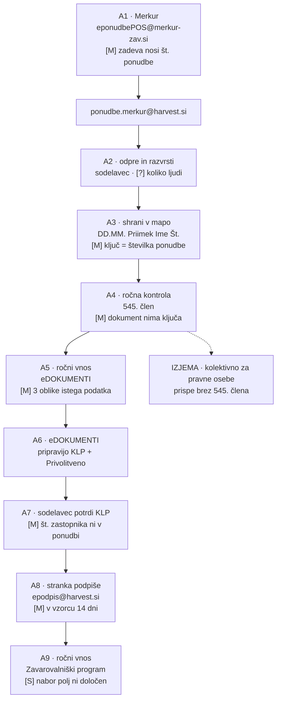

# G0 — Posnetek stanja: proces PRENOS

**Naročnik:** Harvest Hub, zavarovalniško zastopanje d.o.o. · **Izvajalec:** AIS Slovenija — Anej Vučič s.p.
**Datum:** 30. 7. 2026 · **Vrata:** G0 (SCAN) protokola AI Infrastructure Protocol
**Status vrat:** ⚠️ **DELNO ZELENO** — pokritost procesa je popolna, kvantifikacija bolečine ni. Razlog v §7.

---

## 0. Obseg — in kaj je iz tega namenoma izpuščeno

Protokolov G0 predpisuje skeniranje **celotnega podjetja** (vsak oddelek, vsak proces, vsako
orodje) in zeleno vrata šele, ko je *vsak* proces kvantificiran. To je tu napačen izdelek in ga
ne izdelujemo:

1. **Harvest Hub je svojo specifikacijo napisal sam** (`Specifikacija zahtev … 23. 7. 2026`, 5 strani,
   z opredeljenima dvema rešitvama in prilogami). Skeniranje podjetja bi jim prodajali delo, ki so
   ga že opravili.
2. **Kupili so fiksni obseg** (`03-uradna-ponudba.md`, različica A 8.900 € / B 12.000 €) in izrecno
   zavrnili mesečno naročnino. Širši posnetek podjetja ni bil naročen.

Zato je ta posnetek omejen na **en proces: PRENOS**, od prejema pošiljke na
`ponudbe.merkur@harvest.si` do vpisa podatkov v eDOKUMENTE in Zavarovalniški program.

---

## 1. Kako brati oznake

Vsaka trditev v tem dokumentu nosi eno od štirih oznak. Brez oznake ni trditve.

| Oznaka | Pomen |
|---|---|
| **[M]** | **Izmerjeno.** Sami smo pognali ukaz ali prebrali vrstico v izvorniku. Vir je naveden. |
| **[S]** | **Navedla stranka.** Njihova pisna trditev. Nismo je preverili. |
| **[I]** | **Izpeljano.** Sklep iz [M] ali [S]; izpeljava je zapisana. |
| **[?]** | **Neznano.** Podlage ni. V §7 je zapisano, kaj bi vprašanje zaprlo. |

> **Opozorilo o vsebini.** Vzorci vsebujejo prave osebne podatke, tudi podatke iz 9. člena GDPR.
> V tem dokumentu ni nobenega imena stranke, davčne številke, naslova ali kontakta iz vzorcev.
> Navedene so samo **oblike zapisa in številke ponudb**, ki so potrebne za tehnično odločitev.

---

## 2. Zemljevid stanja — korak za korakom

Vir za korake: specifikacija stranke §1 in §3.1 ter priloge na str. 5; dopolnjeno z odgovori
z dne 30. 7. 2026 (`07-odgovori-harvest.md`).

**Metodološka opomba.** Specifikacija §3.1 opisuje **ciljni** (robotiziran) potek. Sedanje stanje
smo iz njega izpeljali z odštevanjem robota, pri čemer so koraki, ki jih specifikacija izrecno
označi kot obstoječe (»v trenutnem procesu ga kreira sistem eDOKUMENTI«), potrjeni neposredno.
Kjer gre za odštevanje, je korak označen **[I]**.

### A1 · Merkur pošlje pošiljko

| | |
|---|---|
| **Izvajalec** | Merkur zavarovalnica (avtomat + skrbnik) |
| **Orodje** | e-pošta; pošiljatelj `EponudbePOS <eponudbePOS@merkur-zav.si>` **[M]** *(zaslonska slika, spec. str. 5)* |
| **Prejemnik** | `ponudbe.merkur@harvest.si` **[S]** *(spec. §3.1)* |
| **Podatki** | celoten paket PDF za eno ponudbo — osebni podatki, davčne št., rojstni datumi, naslovi, upravičenci; pri zdravstvenih in nezgodnih produktih podatki, povezani z zdravjem (9. člen GDPR) **[M]** |
| **Obseg** | 300–500 ponudb/mesec, ~7 PDF/ponudbo, ~2 MB/ponudbo **[S]** *(spec. §2)* |
| **Čas** | ni naš korak |

**Zadeva sporočila je strukturirana in strojno berljiva [M].** V edinem primeru, ki ga imamo:

```
Harvest Hub, zavarovalnisko zastopanje d.o.o.: <PRIIMEK IME>, MERKUR <PRODUKT>, <št. ponudbe>
```

Zadeva torej že vsebuje **priimek in ime, produkt in številko ponudbe** — preden kdorkoli odpre
en sam PDF. To je najcenejši razvrstitveni signal v celotnem procesu in v specifikaciji ni omenjen.
Vzorec je `n = 1`; potrditev na 20 zadevah je v §7.

**Priloge v tem primeru: 5 datotek, skupaj ~744 KB [M]** (Ponudba ~178 KB, IDD ~127 KB,
Informacije o obdelavi osebnih podatkov ~231 KB, 545. člen ~126 KB, SEPA ~82 KB) — proti navedenemu
povprečju ~7 datotek / ~2 MB **[S]**. Povprečje in ta primer si ne nasprotujeta, a pokažeta, da je
obseg pošiljke spremenljiv in ga ni mogoče predpostavljati.

**Odprto [?]:** na zaslonski sliki je nad glavo `From: EponudbePOS …` viden še prikaz
»Od <ime osebe> dne torek, 21. 07. 2026 09:38«. Ali paket prispe **neposredno z avtomata**, ali ga
človek na Merkurju **posreduje naprej** (kar pomeni gnezdene priloge), iz ene slike ni razvidno.
Za sloj prevzema je to razlika med enostavnim in dvostopenjskim razpakiranjem.

### A2 · Sodelavec odpre in razvrsti pošto **[I]**

| | |
|---|---|
| **Izvajalec** | sodelavec Harvest Hub — **koliko jih je, ni znano [?]** *(vprašanje 7 v `01-vprasanja-pred-ponudbo.md` ni bilo odgovorjeno)* |
| **Orodje** | poštni odjemalec |
| **Čas** | **[?]** |

### A3 · Shranjevanje na strežnik v mapo stranke

| | |
|---|---|
| **Izvajalec** | sodelavec |
| **Orodje** | datotečni strežnik (Windows) **[M]** *(zaslonska slika seznama map, spec. str. 5)* |
| **Konvencija** | navedena kot `Datum-Priimek in ime-Številka ponudbe` **[S]**; dejansko vidno `DD.MM. Priimek Ime Številka` — s piko in presledkom, **brez leta in brez pomišljajev** **[M]** |
| **Vsebina mape** | v primeru »stranka 1«: **9 datotek [M]** |
| **Čas** | **[?]** |

Iz seznama map (20 vidnih vrstic, 01.05.–04.05.) **[M]**:

- **Ključ mape je številka ponudbe, ne stranka.** Ista oseba isti dan ustvari več map — v tem
  izseku ena oseba trikrat in dve osebi dvakrat. **To je isti podatek, ki v koraku A5 povzroči
  tveganje podvajanja stranke v eDOKUMENTIH.**
- Priimki so lahko dvodelni (ena vrstica ima štiridelno ime+priimek), zato razdelitev
  imena v mapi ni trivialna.
- Porazdelitev predpon v tem izseku: `33x` 13 · `55x` 5 · `22x` 1 · šestmestna `70xxxx` 1.
  **To ni popis** — pogled je abecedno urejen in odrezan sredi dneva 04.05., 20 map v 4 dneh pa je
  ~5/dan proti izpeljanim 14–24/delovni dan **[I]**. Uporabno kot indikacija mešanice, ne kot delež.

Mapa »stranka 1« vsebuje **[M]**: 545. člen · IDD - Merkur Slovenija ·
Informacije o obdelavi osebnih podatkov **(1)** · Informacije o obdelavi osebnih podatkov ·
**IPID Merkur Otroci** · Ponudba · SEPA · Splošni pogoji … (SPNZO 2025) · Spremni dopis ob ponudbi.

Dve ugotovitvi iz te ene mape:

1. **Podvojena datoteka s pripono `(1)`** — dva izvoda istega tipa dokumenta v enem paketu.
   Robot mora imeti pravilo za podvojitev; specifikacija ga nima.
2. **`IPID`** ni v seznamu tipov dokumentov v specifikaciji §2 (ta navaja `KID`). Realni paket torej
   vsebuje tip, ki v dogovorjeni taksonomiji ne obstaja. Za Fazo 0.

### A4 · Ročna kontrola popolnosti, zlasti 545. člena

| | |
|---|---|
| **Izvajalec** | sodelavec **[S]** *(spec. §1: »številne ročne kontrole uporabnika«)* |
| **Orodje** | pogled v mapo |
| **Čas** | **[?]** |

**Izjema, ki jo določa specifikacija [S]:** pri kolektivnih zdravstvenih in nezgodnih zavarovanjih
za pravne osebe celoten postopek izvede skrbnik na Merkurju, zato paket **upravičeno** prispe brez
545. člena.

**Izmerjena ovira, ki je specifikacija ne obravnava [M].** V vzorčnem dokumentu 545. člen ni
**nobene** številke ponudbe in **nobenega** imena stranke — edini številski niz na dokumentu je
poštna številka francoskega naslova ene od navedenih zavarovalnic. Dokument nosi ime zastopnika,
njegovo dovoljenje AZN, seznam zastopanih zavarovalnic in dve podpisni polji
(`signer=AGENTS`, `signer=CUSTOMERS`). **Povezava 545. člena s konkretno ponudbo torej obstaja samo
prek pripadnosti paketu — ne prek nobenega polja na dokumentu.** Ista omejitev velja za Privolitveno
izjavo (glej A8). Posledica: pri paketu z več ponudbami in enim 545. členom ni mogoče strojno
ugotoviti, kateri ponudbi pripada. *(Ta omejitev je v prikazu že pravilno zapisana — `demo/lib/gate.js`
preverja prisotnost in izrecno ne trdi ujemanja.)*

### A5 · Ročni vnos metapodatkov v eDOKUMENTE

| | |
|---|---|
| **Izvajalec** | sodelavec **[S]** *(spec. §1: »ročni vnos metapodatkov v sistema eDOKUMENTI in Zavarovalniški program«)* |
| **Orodje** | eDOKUMENTI (spletni obrazec) |
| **Podatki** | zavarovalec, zavarovanec, kontakt, naslov, št. ponudbe, zastopnik |
| **Čas** | **[?]** |

**Ciljni zaslon je od 30. 7. 2026 znan [S]** *(zaslonska slika v `07-odgovori-harvest.md`)*:
zavihki `Zavarovalec` · `Zavarovanec` · `Privolitvena izjava` · `Kontrolni list ponudb`;
razdelki `IZBERI STRANKO` (spustni seznam z internim ID + gumb `Dodaj novo stranko`),
`DODATNI PODATKI STRANKE` (**Ime** in **Priimek** ločeno), `KONTAKT` (**Email**, klicna koda in
številka **ločeno**), `NASLOV` (**Ulica · Hišna številka · Poštna številka · Kraj** — štiri polja).

**To ni prepis, ampak preoblikovanje. Isti podatek ima v treh dokumentih tri oblike [M]:**

| Podatek | Ponudba (izvor) | KLP / Privolitvena | eDOKUMENTI (cilj) |
|---|---|---|---|
| Ime osebe | ena vrstica | ena vrstica; na KLP **obrnjen vrstni red** (`Priimek Ime`) | **dve polji** |
| Naslov | ena vrstica | Privolitvena: `Ulica` (s hišno št.) + `Pošta in poštna številka` | **štiri polja** |
| Telefon | `+386` + 8 mest, **brez vodilne ničle** (vseh 8 digitalnih ponudb) | `+386` + 9 mest, **z vodilno ničlo** | klicna koda ločena, številka brez vodilne ničle |

Ta tri neujemanja so **vsa izmerjena na strankinih lastnih vzorcih** in so glavni razlog, da je
ročni vnos počasen in dovzeten za napake. Delitve, ki jih obstoječa koda še ne zna (hišna številka
od ulice, kraj od poštne številke), so zabeležene v `07-odgovori-harvest.md`.

**Tveganje podvajanja stranke.** Zapis stranke v eDOKUMENTIH nosi interni ID; sodelavec mora
obstoječo stranko **poiskati** ali ustvariti novo. Ker ena oseba v enem dnevu ustvari več ponudb
(A3, **[M]**), je to redna, ne robna situacija. Specifikacija tega ne obravnava.

### A6 · eDOKUMENTI pripravijo KLP in Privolitveno izjavo

| | |
|---|---|
| **Izvajalec** | sistem eDOKUMENTI **[S]** *(spec. §2: »v trenutnem procesu ga kreira sistem eDOKUMENTI«)* |
| **Izhod** | KLP (Kontrolni list ponudb) in Privolitvena izjava, oba PDF **[M]** *(vzorca sta mPDF 6.0)* |

Vsebina KLP iz vzorcev **[M]**: dva stolpca (`ZAVAROVALEC` / `ZAVAROVANEC`) po štiri polja
(ime in priimek, naslov s pošto in krajem, telefon/mobitel, e-pošta), `Zavarovalnica`,
`Št. ponudbe`, ter dve vrstici zastopnika (`Ime in priimek` + `Številka zav. zastopnika`).
**Skupaj 14 polj.**

### A7 · Sodelavec potrdi KLP

| | |
|---|---|
| **Izvajalec** | sodelavec (vsakemu se prikaže posebej) **[S]** *(spec. §3.1)* |
| **Dejanje** | pregled, po potrebi dopis **pomožnega zavarovalnega zastopnika**, potrditev. Elektronski podpis ni potreben. **[S]** |
| **Čas** | **[?]** |

Trije izmerjeni robovi tega koraka **[M]**:

- **Številka zavarovalnega zastopnika (`NNN-NNNN`, npr. `120-2089`) ne obstaja v nobeni ponudbi.**
  Ponudbe nosijo licenco AZN (druga oblika, drug register). Iskanje oblike `NNN-NNNN` po vseh
  ponudbah vrne nič. Podatek živi izključno v internem registru zastopnikov Harvest Hub.
- **Št. ponudbe na vzorčnem KLP je šestmestna** (`703168`), ponudbe pa nosijo devetmestne. Na drugem
  vzorčnem KLP je enajstmestna (`44002683447`) — in ta KLP je obrazec **druge zavarovalnice**
  (Allianz), ne Merkurja. Katera številka sodi v to polje, ni razrešeno **[?]**.
- **Kdaj se izpolni druga vrstica zastopnika, ni znano [?]** — pravilo za pomožnega zastopnika
  ni bilo posredovano.

### A8 · Privolitvena izjava k stranki v izpolnitev in podpis

| | |
|---|---|
| **Izvajalec** | sodelavec pošlje, **stranka** izpolni in podpiše **[S]** *(spec. §3.1)* |
| **Oblika podpisa** | slikovni prikaz podpisa, **ne** kvalificiran e-podpis **[S]** |
| **Povratni kanal** | `epodpis@harvest.si` **[M]** *(natisnjen na vzorčni Privolitveni izjavi pod poljem »Datum podpisa«)* |
| **Čas do vrnitve** | v edinem vzorcu **14 dni** (`Kraj, datum` 14. 10. → `Datum podpisa` 28. 10., ura 12:00:05) **[M, n = 1]** |

Ta korak je edini v celotnem procesu, kjer **čakalna doba ni odvisna od Harvest Hub**. Vzorec je
`n = 1` in iz njega ni mogoče sklepati na povprečje, je pa dovolj, da se v Fazi 0 postavi vprašanje
o zastojih tu — ne o hitrosti prepisovanja.

### A9 · Ročni vnos metapodatkov v Zavarovalniški program

| | |
|---|---|
| **Izvajalec** | sodelavec **[S]** |
| **Sprožilec** | potrjen KLP **in** prejeta podpisana Privolitvena izjava **[S]** *(spec. §3.1)* |
| **Nabor polj** | **ni določen [S]** — »za zavarovalniški program pripravimo naknadno, potrebno narediti šifrant zavarovalnice in povezati s šifrantom iz zavarovalniškega programa« *(`07-odgovori-harvest.md`)* |
| **Čas** | **[?]** |

Ta odgovor je za obseg pomembnejši, kot je videti: **prenos v Zavarovalniški program je odložen in
pogojen z izdelavo šifranta ter preslikavo med šifrantoma.** Ponudba (`03-uradna-ponudba.md`) ta
prenos šteje med komponente osnovnega obsega, izdelava šifranta pa v njej ni omenjena. To je
neujemanje za Fazo 0, ne za danes.

---

## 3. Povzetek zemljevida



---

## 4. Popis dokumentov — **to je kvantificirani del**

Vseh 15 priloženih vzorcev je bilo izmerjenih neposredno (`PyMuPDF`, 30. 7. 2026: število strani,
število natisljivih znakov brez presledkov v besedilnem sloju, metapodatka `producer`/`creator`).

| # | Dokument | Str. | Znakov | Izdelal (`producer` / `creator`) | Tir |
|---|---|---:|---:|---|---|
| 1 | 545. člen | 1 | 4.639 | wkhtmltopdf | besedilo |
| 2 | KLP — en zastopnik | 1 | 535 | mPDF 6.0 | besedilo |
| 3 | KLP — dva zastopnika | 1 | 598 | mPDF 6.0 | besedilo |
| 4 | Privolitvena izjava | 1 | 2.407 | mPDF 6.0 | besedilo |
| 5 | 1 – Naložbeno | 3 | 10.344 | wkhtmltopdf + iTextSharp 5.1.2 | besedilo |
| 6 | 2 – Nezgoda | 2 | 2.904 | wkhtmltopdf + iTextSharp 5.1.2 | besedilo |
| 7 | 2 – Otroci (1 otrok) | 2 | 2.835 | wkhtmltopdf + iTextSharp 5.1.2 | besedilo |
| **8** | **2 – Merkur, dva otroka** | 1 | **65** | **Microsoft: Print To PDF** | **slika** |
| **9** | **3 – Otroci, več produktov** | 1 | **132** | **Canon iR-ADV C3320** | **slika** |
| 10 | 4 – Premoženje | 4 | 6.135 | wkhtmltopdf | besedilo |
| 11 | 5 – Riziko | 3 | 2.735 | wkhtmltopdf + iTextSharp 5.1.2 | besedilo |
| 12 | 6 – Zdravstveno | 2 | 2.794 | wkhtmltopdf + iTextSharp 5.1.2 | besedilo |
| 13 | 7 – Popotnik | 1 | 1.960 | wkhtmltopdf + iTextSharp 5.1.2 | besedilo |
| 14 | 8 – Business box | 3 | 3.554 | wkhtmltopdf + iTextSharp 5.1.2 | besedilo |
| **15** | **9 – Kolektivno Zdravje** | 2 | **21** | **Canon iR-ADV C3320** | **slika + rokopis** |

**12 od 15 ima uporaben besedilni sloj, 3 ga nimajo [M].**

> **Popravek (3. 8. 2026).** Prejšnja različica tega odstavka je trdila, da je razvrščanje »trdno,
> ne mejno«, ker je razmik med najslabšim digitalnim dokumentom (535 znakov) in najboljšim
> skeniranim (132) štirikraten. **To je napačna primerjava.** Razvrščanje ne primerja obeh skupin
> med sabo — vsak dokument primerja s **pragom 500 znakov** (`demo/lib/layout.js`). Merodajen je
> torej razmik med 535 in 500, kar je **7 %, ne štirikratnik**.
>
> Posledica: **»KLP — en zastopnik« je 35 znakov nad pragom.** Isti dokument s krajšim imenom,
> krajšim naslovom ali enim praznim poljem pade pod prag in se ne prebere iz besedila, temveč iz
> **slike celotne prve strani** — ki nosi tudi podpise, žige in ročne opombe. Za Fazo 1 to pomeni
> dvoje: prag je treba določiti z meritvijo na večjem vzorcu, ne prevzeti, in pot s sliko mora biti
> v pogodbi opisana kot **pot za dokumente brez uporabnega besedilnega sloja**, ne kot »pot za
> skenirane dokumente« (glej Aneks 1, A3(b)).

Manjše odstopanje od tehnične priloge: `02-ponudba-prenos-zero.md` navaja 78 in 164 znakov za
dokumenta 8 in 9. Naša meritev je 65 in 132, ker **ne šteje presledkov**. Sklep je isti; številke v
prilogi so nekoliko višje od naših.

### 4.1 Razlike v poljih med produkti — izmerjeno

Prisotnost oznak polj v besedilnem sloju vseh 12 dokumentov z besedilom **[M]**:

| Produkt | Št. ponudbe | Št. pogodbe | Zastopnik + licenca | Rojstni datum | Pravna oblika | Matična | Otroci | Upravičenci |
|---|:--:|:--:|:--:|:--:|:--:|:--:|:--:|:--:|
| 1 – Naložbeno | ✔ `550002145` | — | ✔ | ✔ | — | — | — | ✔ |
| 2 – Nezgoda | ✔ `330009276` | — | ✔ | ✔ | — | — | — | ✔ |
| 2 – Otroci (1) | ✔ `330008010` | — | ✔ | ✔ | — | — | ✔ | — |
| 4 – Premoženje | — | ✔ `703179` | ✔ | ✔ | — | — | — | ✔ |
| 5 – Riziko | ✔ `220004272` | — | ✔ | ✔ | — | — | — | ✔ |
| 6 – Zdravstveno | ✔ `110004554` | — | ✔ | ✔ | — | — | — | ✔ |
| 7 – Popotnik | — | ✔ `529404` | **—** | ✔ | — | ✔ | — | — |
| 8 – Business box | ✔ `440000040` | — | ✔ | **—** | ✔ | — | — | — |

Kar iz te tabele sledi:

- **Enotna predloga za vse produkte ne more delovati.** Nobena od osmih vrstic ni enaka drugi.
- **Popotnik nima bloka zastopnika** — robot zanj ne sme izmisliti zastopnika, temveč vrniti prazno.
- **Business box nima rojstnega datuma, ima pa pravno obliko** — po tem se prepozna pravna oseba;
  oznaka `Naziv` se uporablja za fizične in pravne osebe in zato ni uporaben signal.
- **Premoženje in Popotnik nimata polja »Številka ponudbe«**, temveč šestmestno »Številko pogodbe«.

### 4.2 Družine številk ponudbe

| Predpona | Produkt | Primeri **[M]** | Vzorcev |
|---|---|---|---:|
| `11x` | Zdravstveno | `110004554` | 1 |
| `22x` | Riziko | `220004272`, `220003171` | 2 |
| `33x` | Nezgoda (tudi otroci) | `330009276`, `330008010`, `330008730`, +13 iz seznama map | 16 |
| `44x` | Business box (pravne osebe) | `440000040`, `44002683447` (11-mesten, KLP) | 2 |
| `55x` | Naložbeno | `550002145`, +5 iz seznama map | 6 |
| `70xxxx` | Premoženje (šestmestna »št. pogodbe«) | `703179`, `703168` (KLP), `702727` (mapa) | 3 |
| `52xxxx` | Popotnik (šestmestna »št. pogodbe«) | `529404` | 1 |

Prvih pet vrstic je bilo neodvisno potrjenih **trikrat**: v dokumentih, v seznamu map na strežniku
in v zadevi e-pošte (`MERKUR NEZGODA, 330008730` → predpona `33` ✔).

**Popravek dosedanje formulacije.** Ponudba in tehnična priloga pravita, da Premoženje in Popotnik
»tega polja nimata«. Natančneje: **nimata devetmestne številke ponudbe, imata pa šestmestno številko
pogodbe, ki prav tako nosi družino** (`70x` oz. `52x`). Vzorcev je malo (3 in 1), zato to ostane
notranja navzkrižna kontrola in **ne** sme na zaslon kot validacijsko pravilo. Poslane ponudbe
zaradi tega ni treba popravljati — njena formulacija drži.

### 4.3 Neskladja v strankinih lastnih dokumentih **[M]**

Najdena mimogrede, med merjenjem. Niso očitek — so tisto, kar bo robot ujel in kar mora imeti pravilo.

| Najdeno | Kje | Zakaj šteje |
|---|---|---|
| `info@harvest.si` proti `info@harvesthub.si` | 545. člen proti Privolitveni izjavi | dve različni domeni v dveh obrazcih iste družbe |
| `IGOR.PLETERSKI @GMAIL.COM` — presledek pred `@` | KLP (dva zastopnika) | e-naslov v tej obliki ni veljaven; nastal je ob vnosu |
| e-naslov, zapisan v celoti z velikimi črkami | 6 – Zdravstveno | e-naslovi prihajajo v mešani pisavi; normalizacija je nujna |
| Rdeč rokopisni pripis »Doba napišeš 1 leto« ob natisnjenem »15 let« | 8 – dva otroka (skenirano) | vizualni model prebere oboje; brez ločevanja natisnjeno/pripis lahko izbere napačno |

---

## 5. Kje gredo ure — in zakaj tu ni številke

**Stranka je 30. 7. 2026 pisno odgovorila: »Ne razpolagamo s podatkom.«** *(`07-odgovori-harvest.md`,
vprašanje o minutah na ponudbo.)* Na vprašanje o številu vključenih sodelavcev **ni odgovorila**.

Zato v tem dokumentu **ni nobene številke o prihranku, urah ali dobi vračila.** Nobene. Vsaka bi
bila izmišljena. Notranji plan (`PLAN-prenos-zero.md`, vrstica 322) nosi 10 in 15 minut z izrecno
oznako *TO BE CONFIRMED BY CLIENT* — to sta ostali domnevi in ju ni dovoljeno predstaviti kot podatek.

Kar **lahko** trdimo, je, **kje** se ure porabljajo, ker so ta mesta izmerjena:

| Mesto | Zakaj tam nastaja delo | Dokaz |
|---|---|---|
| A5 — vnos v eDOKUMENTE | isti podatek se preoblikuje: ime 1→2 polji, naslov 1→4 polja, telefon spremeni obliko | **[M]** §2/A5 |
| A5 — iskanje stranke | ena oseba ima več ponudb; treba je poiskati ali ustvariti zapis | **[M]** seznam map |
| A3 — poimenovanje mape | zahteva številko ponudbe in razdeljeno ime; oboje je treba prebrati | **[M]** zaslonska slika |
| A4 — kontrola 545. člena | dokument nima ključa; presoja je vizualna, po pripadnosti mapi | **[M]** vzorec 545 |
| A7 — številka zastopnika | podatka ni v nobenem vhodnem dokumentu; sodelavec ga pozna ali poišče | **[M]** iskanje po 11 ponudbah |
| A8 — čakanje na podpis | zunaj nadzora družbe | **[M, n = 1]** 14 dni |
| A9 — drugi vnos istih podatkov | isti podatki se vnesejo v drugi sistem | **[S]** spec. §1 |

**Kje nastajajo napake** — tudi to iz meritev, ne iz domnev: tri oblike telefonske številke, dve
obliki naslova, obrnjen vrstni red imena na KLP, e-naslovi v mešani pisavi in en s presledkom,
podvojena datoteka v paketu, dokument (`IPID`) izven taksonomije, in številka zastopnika, ki je v
vhodnih dokumentih sploh ni.

**Kako izpeljati manjkajočo številko na sestanku.** Panel »Koliko časa to vzame danes?« v prikazu
ni več orodje za zajem njihove številke, ampak orodje, s katerim jo **skupaj sestavimo** iz zgornjih
sedmih mest. Številko naj izreče stranka, mi jo samo seštejemo — in v zapisniku mora ostati zapisano,
da gre za njihovo oceno, ne za meritev.

---

## 6. Ugotovitve, ki spreminjajo obseg

Naštete brez olepšave; vsaka ima posledico za Fazo 0.

1. **Prenos v Zavarovalniški program zahteva izdelavo šifranta in preslikavo [S].** Ponudba ga
   uvršča v osnovni obseg, izdelave šifranta ne omenja. Uskladiti v Fazi 0.
2. **API bo na voljo [S]** — »planirajte, da dokumentiran API dobimo«; dobavitelj eDOKUMENTOV je
   seznanjen. R1 iz ponudbe s tem ni več tehnično, ampak **terminsko** tveganje: ni datuma in ni
   naša pristojnost.
3. **eDOKUMENTI zahtevajo štiridelni naslov**, obstoječa delitev v `demo/lib/klp.js` zna dvodelno.
   Manjkata ločitev hišne številke od ulice in kraja od poštne številke. *(Ugotovitev, ne popravek —
   prikaz je zamrznjen.)*
4. **Podvajanje stranke v eDOKUMENTIH je redna situacija, ne robna** — dokazano s seznama map.
   V specifikaciji ni obravnavano.
5. **545. člen in Privolitvena izjava nimata ključa za povezavo s ponudbo.** Vsak nadzor nad njima
   je vezan na pripadnost paketu.
6. **Zadeva e-pošte je neizkoriščen strukturiran vir** (priimek, ime, produkt, številka ponudbe).
7. **Prazna mesta obsega, ki ostajajo:** pravilo za drugega zastopnika, katera številka gre v polje
   `Št. ponudbe` na KLP, ali se nabor polj razlikuje med tipi zavarovanj (vprašanje 5 ni bilo
   odgovorjeno), in konkretni roki hrambe po ZZavar-1 (odgovor je bil splošen).

### 6.1 Trditev, ki je v naših dokumentih napačna — ni del posnetka, a mora biti tu zapisana

`02-ponudba-prenos-zero.md` (vrstice 124, 274, 413), `04-PLAN-demo.md` (155) in
`PLAN-prenos-zero.md` (95, 170–171, 272, 418) trdijo **»obdelava izključno znotraj EU«**.
Preverjeno na živem API-ju 30. 7. 2026: parameter `inference_geo` sprejme samo `global` in `us`;
vrednost `eu` je zavrnjena. Prikaz parametra ne pošilja, torej teče na `global`.

**Poslana ponudba `03-uradna-ponudba.md` te trditve ne vsebuje** — pravi, da ponudnika in regijo
obdelave potrdimo v Fazi 0. To je preverjeno (vrstici 174–176).

Odprto **[?]**: ali je bila tehnična priloga (`Ponudba-PRENOS-ZERO-Harvest-Hub.pdf`) stranki kdaj
poslana. Če je, gre za pisno trditev, ki ne drži, pri zavezancu po ZZavar-1. To ni vprašanje za G0,
je pa vprašanje, ki mora biti odgovorjeno pred G3.

---

## 7. Zakaj vrata G0 niso povsem zelena

Protokolov pogoj: *»scan pokriva vsak proces, ki ga je podjetje navedlo, vsakega z orodji, podatki,
obsegom in bolečino — kvantificirano.«*

| Pogoj | Stanje |
|---|---|
| Pokritost procesa PRENOS od A1 do A9 | ✅ popolna |
| Orodja in akterji na vsakem koraku | ✅ *(razen števila sodelavcev)* |
| Podatki na vsakem koraku | ✅ |
| Obseg | ⚠️ na ravni **[S]** (300–500/mes., ~7 dok.) — nismo ga preverili in ga brez dostopa do nabiralnika ne moremo |
| **Bolečina, kvantificirana** | ❌ **stranka podatka nima** |
| Pokritost celotnega podjetja | ⛔ **namenoma izpuščeno** (§0) |

**Vrata zato ostajajo delno zelena in tako morajo ostati.** Zeleno jih naredi eno od dveh:
merjenje na živem prometu v Fazi 0, ali skupna izpeljava s stranko na sestanku — ki pa se v zapisniku
označi kot ocena, ne kot meritev.

### Kaj bi zaprlo posamezno neznanko

| # | Neznanka | Kaj jo zapre |
|---|---|---|
| 1 | Minute na ponudbo | Merjenje: sodelavec za 10 zaporednih ponudb zabeleži začetek in konec (~1 dan) |
| 2 | Število vključenih sodelavcev | Eno vprašanje |
| 3 | Ali paket prispe neposredno ali posredovan | Ena surova `.eml` datoteka z glavami |
| 4 | Ali se nabor polj razlikuje med tipi zavarovanj | Vprašanje 5, ponovno postavljeno |
| 5 | Katera številka gre v `Št. ponudbe` na KLP | Trije resnični pari ponudba → izpolnjen KLP |
| 6 | Pravilo za drugega (pomožnega) zastopnika | Eno vprašanje |
| 7 | Register zastopnikov (`ime → NNN-NNNN`) | ~20 vrstic v Excelu |
| 8 | Roki hrambe po ZZavar-1 in interni politiki | Njihova interna politika hrambe |
| 9 | Ali paket vedno vsebuje `Spremni dopis` in `IPID` | 20 zaporednih realnih paketov, samo seznam datotek |
| 10 | Dejanska mesečna mešanica produktov | Izvoz seznama map za en cel mesec (samo imena map) |

Točke 2, 4, 5, 6 in 7 so že v osnutku e-pošte `05-email-pred-demom.md`. Točke 1, 3, 9 in 10 niso in
so **poceni** — nobena ne zahteva osebnih podatkov razen 9 in 10, ki potrebujeta le imena datotek
oziroma map.

---

## 8. Kasneje, ne zdaj

Ni predmet naročenega obsega in se ne sme predstaviti kot potrebno. Zapisano samo zato, da se ne
izgubi.

- **Prevzem prek zadeve e-pošte.** Razvrstitev in poimenovanje mape iz zadeve, brez odpiranja PDF.
- **Razrešitev podvajanja strank v eDOKUMENTIH** kot samostojna funkcija (iskanje po e-naslovu in
  davčni številki pred `Dodaj novo stranko`).
- **Šifrant zavarovalnice in preslikava v Zavarovalniški program** — po odgovoru z dne 30. 7. je to
  nova naloga; ovrednotiti ločeno, ko bo nabor polj znan.
- **Merjenje trajanja koraka A8** (čakanje na podpis stranke). Če je zastoj tam in ne v prepisovanju,
  je to drug projekt z drugačno donosnostjo — in pošteneje je, da to izvemo prej kot pozneje.

---

## Priloge — kaj je bilo pognano

| Kaj | Nad čim | Kdaj |
|---|---|---|
| `PyMuPDF`: `page_count`, dolžina besedilnega sloja brez presledkov, `metadata` | 15 vzorčnih PDF | 30. 7. 2026 |
| `PyMuPDF`: iskanje oznak polj in številskih nizov 6–12 mest | 15 vzorčnih PDF | 30. 7. 2026 |
| `PyMuPDF`: iskanje telefonov in e-naslovov z regularnim izrazom | 15 vzorčnih PDF | 30. 7. 2026 |
| Izris strani 5 specifikacije pri 170 dpi in vizualni odčitek treh zaslonskih slik | specifikacija stranke | 30. 7. 2026 |
| Branje izvorne kode (brez sprememb) | `demo/lib/{extract,classify,gate,edokumenti}.js`, `demo/README.md` | 30. 7. 2026 |

**Koda prikaza ni bila spremenjena.** Nobena datoteka pod `clients/harvest-hub/demo/` ni bila
odprta za pisanje.
